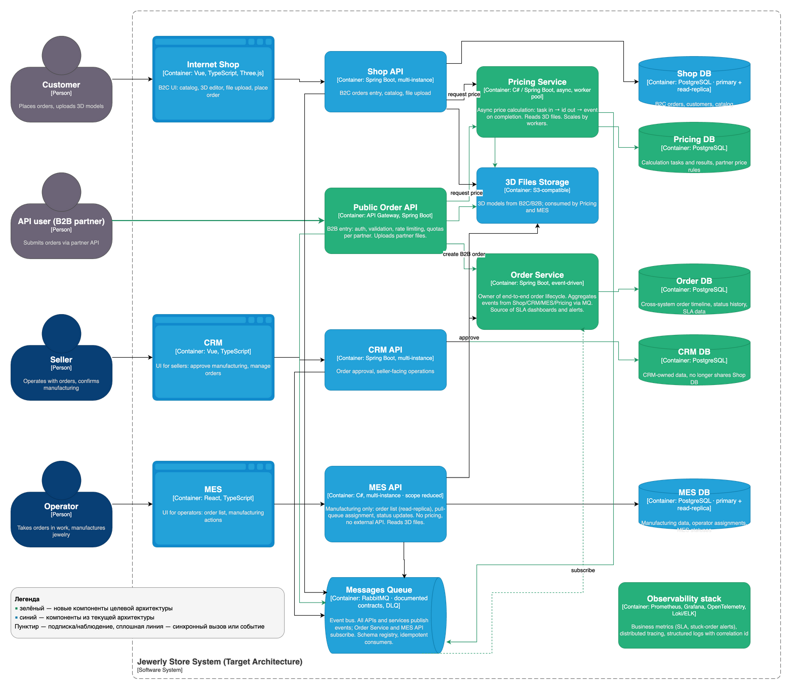

# Планирование: анализ, идентификация проблем и поиск решений

## 1. Анализ архитектуры и идентификация проблем

Проблемы сгруппированы по типу. В колонке «Приоритет» указана степень (**высокий / средний / низкий**) и короткое обоснование. Колонка «Как решить» ссылается на инициативы из раздела 2.

### 1.1. Архитектурные изъяны

| # | Проблема | Как решить | Приоритет |
|---|---|---|---|
| A1 | Внешний API-партнёр обращается напрямую к MES API. MES — внутренняя производственная система; внешний контракт оказывается связан с внутренней моделью производства, а рост B2B-нагрузки напрямую увеличивает нагрузку на производственное приложение. Это объясняет ухудшение работы операторов сразу после открытия API. | **I3** — поставить перед MES публичный Order API с аутентификацией, валидацией и маппингом во внутренние команды; партнёры больше не обращаются к MES напрямую. | **высокий** — непосредственная причина потери крупных B2B-контрактов |
| A2 | Расчёт стоимости (2–30 минут) выполняется внутри MES API синхронно. MES API одновременно отвечает за расчёт цены, назначение операторов и список заказов. Длительные задачи выполняются в одном процессе с интерфейсом операторов, что приводит к замедлению дашборда и таймаутам запросов. Отсутствуют очередь задач, пул воркеров, ретраи и идемпотентность. | **I2** — вынести расчёт стоимости в отдельный сервис Pricing с очередью задач и пулом воркеров; асинхронный API: «принять задачу — вернуть id — ожидать событие о завершении». | **высокий** — первопричина замедлений MES API и таймаутов клиентских запросов |
| A3 | Заказ через публичный API создаётся в CRM через сообщение от MES. Точка входа в систему находится в производственном модуле, что нарушает естественное направление потока данных. Статусы INITIATED/FILE_UPLOADED/SUBMITTED, принадлежащие шопу в B2C-сценарии, для B2B-заказов не возникают. Это типичный источник «потерянных» заказов на стыках систем. | **I3** — единая точка входа для B2B-заказов через Public Order API; **I5** — Order Service как владелец сквозного жизненного цикла заказа. | **средний** — ухудшает прослеживаемость заказов, устраняется после A1 |
| A4 | CRM API обращается к Shop DB. Это антипаттерн shared database: два сервиса работают с одной БД, любые изменения схемы становятся дорогими, нагрузки складываются, независимое масштабирование невозможно. | **I6** — развязать CRM API и Shop DB: вынести необходимые данные за Shop API или передавать через события. | **средний** — замедляет развитие систем, но не блокирует текущую работу |
| A5 | Отсутствует владелец сквозного статуса заказа. Статусы распределены между тремя системами; ни одна из них не отвечает за выполнение SLA «3 недели». Руководство не имеет данных о том, **где** именно задерживаются заказы. | **I5** — Order Service слушает события из шопа/CRM/MES и хранит таймлайн заказа; **I1** — метрики времени в каждом статусе как промежуточный шаг с быстрой отдачей. | **средний** — частично компенсируется метриками из I1 |
| A6 | RabbitMQ-интеграция реализована без явных контрактов. Отсутствуют схема событий, версионирование, dead-letter-очереди, политика ретраев. Скрытые потери сообщений могут быть причиной незаметного зависания заказов. | **I5** — стандартизировать контракты событий в schema registry, ввести DLQ и идемпотентные обработчики. | **низкий** — фактические потери сообщений не подтверждены данными |

### 1.2. Производительность и масштабирование

| # | Проблема | Как решить | Приоритет |
|---|---|---|---|
| B1 | Каждый сервис и каждая БД работают в одном инстансе. Отсутствуют горизонтальное масштабирование и HA; любой деплой или инцидент приводит к простою. БД обслуживает запись и чтение одной нодой — это одновременно потолок производительности и точка отказа. | **I7** — поднять по 2 инстанса каждого приложения за балансировщиком нагрузки; добавить read-реплики в Shop DB и MES DB. Реализовать после I2. | **высокий** — единая точка отказа на критичном пути B2C и B2B |
| B2 | Дашборд MES медленно загружается. Пагинация и фильтр по статусам не дали результата — узкое место не в объёме данных, а в самой выборке (отсутствие или неэффективность индексов, полное сканирование, N+1) и в конкуренции с длительными расчётами цены за ресурсы того же MES API. | **I4** — добавить индексы под сортировку «новые сверху», перевести выборку на read-реплику; **I2** — снять с MES расчёт цены для освобождения CPU. | **высокий** — ежедневно снижает производительность операторов |
| B3 | Модель «кто первым кликнул — тот взял заказ». Это бизнес-уровневое состояние гонки: операторы конкурируют за свежие заказы, генерируя одновременные тяжёлые запросы к БД; распределение нагрузки получается неравномерным. | **I4** — заменить модель «первый клик» на pull-очередь со справедливым распределением (fair assignment). | **средний** — затрагивает мотивацию операторов и нагрузку на БД, но не критично для работоспособности |
| B4 | Отсутствуют кэши и read-реплики. Список заказов на дашборде — типичная горячая выборка, подходящая для реплики или materialized view. | **I7** — read-реплики; при необходимости — отдельная проекция данных под дашборд. | **низкий** — дополнительная оптимизация поверх I7 |

### 1.3. Наблюдаемость и SLA

| # | Проблема | Как решить | Приоритет |
|---|---|---|---|
| C1 | Отсутствуют метрики по жизненному циклу заказа. При наличии жалоб нет данных о том, в каком статусе заказы задерживаются дольше всего. Приоритизация инициатив выполняется без опоры на факты. | **I1** — метрики времени в каждом статусе, дашборд SLA, бизнес-метрики в Grafana. | **высокий** — без этих данных приоритизация остальных инициатив необоснована |
| C2 | Отсутствуют распределённый трейсинг и единое логирование. Три приложения, очередь, S3, две БД — нет возможности проследить путь конкретного заказа сквозь систему. | **I10** — OpenTelemetry → Jaeger/Tempo, структурированные логи с correlation id. | **средний** — необходим для разбора инцидентов, но не блокирует оперативное реагирование |
| C3 | Отсутствуют алерты по бизнес-метрикам: «заказ находится в статусе X более N часов», «очередь расчёта растёт», «доля просроченных API-заказов». | **I1** — алерты на задержавшиеся заказы поверх метрик жизненного цикла. | **средний** — позволяет реагировать проактивно, но требует предварительной реализации I1 |

### 1.4. Процессы и команда

| # | Проблема | Как решить | Приоритет |
|---|---|---|---|
| D1 | Ручное E2E-тестирование силами одного QA блокирует релизы. Уже сейчас задержки превышают месяц; с ростом числа фич ситуация будет линейно ухудшаться. | **I8** — пирамида автотестов (контрактные тесты на стыках сервисов, smoke E2E в CI), переориентация QA на автоматизацию; **I12** — найм QA-автоматизатора. | **высокий** — блокирует доставку любых исправлений и улучшений |
| D2 | Деплой в release и prod выполняется вручную. Это замедляет реакцию на инциденты и увеличивает риск ошибок при выкладке. | **I9** — автоматизированный deploy в release, «кнопка promote» с предварительными проверками для prod. | **средний** — критично при инцидентах, в штатном режиме допустимо |
| D3 | В команде один DevOps-инженер. Единая точка отказа на уровне инфраструктуры; нагрузка на этого специалиста будет расти при увеличении числа окружений. | **I12** — найм дополнительного SRE/DevOps. | **низкий** — нереализованный риск, возрастающий по мере расширения инфраструктуры |
| D4 | Двухнедельные спринты в сочетании с длительной стабилизацией перед prod. Исправления по жалобам клиентов доходят до prod с большой задержкой. | **I8 + I9** — автотесты сокращают стабилизационное окно, автодеплой ускоряет выкладку. | **низкий** — следствие D1 и D2, устраняется вместе с ними |

### 1.5. Безопасность и устойчивость публичного API

| # | Проблема | Как решить | Приоритет |
|---|---|---|---|
| E1 | Отсутствуют рейт-лимиты и квоты для B2B-потребителей. После открытия API наблюдается резкий рост числа заказов; один партнёр способен полностью занять ресурс расчёта. | **I11** — квоты и рейт-лимиты на уровне партнёра в Public Order API. | **средний** — простая в реализации мера, выполняется вместе с I3 |
| E2 | Отсутствует приоритизация заказов между B2C и B2B. Все потоки конкурируют за единственный MES; SLA по контрактам не отражены в маршрутизации. | **I3** — выделенный поток для B2B через Public Order API, очереди с приоритетами в Pricing/MES. | **низкий** — требует уточнения SLA по контрактам со стороны бизнеса |

---

## 2. Список инициатив

Полные описания приведены в колонке «Как решить» раздела 1. Здесь — сводный реестр для ссылок из последующих разделов.

| # | Инициатива | Размер |
|---|---|---|
| I1 | Наблюдаемость жизненного цикла заказа: метрики времени в статусах, дашборд SLA, алерты | M |
| I2 | Pricing — отдельный сервис расчёта стоимости с очередью и пулом воркеров | L |
| I3 | Public Order API перед MES: аутентификация партнёров, валидация, маппинг во внутренние команды | L |
| I4 | Дашборд и модель назначения операторов: индексы, read-реплика, pull-очередь со справедливым распределением | M |
| I5 | Order Service как владелец сквозного статуса заказа; стандартизация контрактов событий | L |
| I6 | Развязка CRM API и Shop DB через API/события | M |
| I7 | Горизонтальное масштабирование сервисов и read-реплики БД | M |
| I8 | Пирамида автотестов и переориентация QA на автоматизацию | L |
| I9 | Автоматизация deploy в release, «кнопка promote» в prod | S |
| I10 | Distributed tracing (OpenTelemetry) и структурированные логи с correlation id | M |
| I11 | Квоты и рейт-лимиты на Public Order API на уровне партнёра | S |
| I12 | Найм: QA-автоматизатор, дополнительный SRE/DevOps, при необходимости — C#-инженер | M |

---

## 3. Приоритизация и обоснование

Поток жалоб распадается на три кластера:
1. **«Не получили заказ»** (B2C и B2B) — это про сквозной SLA. Мы даже не знаем, где заказы зависают.
2. **«MES тормозит»** — операторы не могут эффективно работать.
3. **«После открытия API всё стало хуже»** — внешняя нагрузка ударила прямо в производственную систему.

Все три кластера упираются в **одну архитектурную ошибку**: MES API делает слишком много (расчёт + дашборд + назначение + точка входа для B2B), и любое внешнее событие проходит через него. Это объясняет, почему пагинация и фильтр не помогли — узким местом стал не объём данных, а конкуренция за процессорное время сервиса.

### 3.1. Полный порядок инициатив

1. **I1** — наблюдаемость жизненного цикла заказа
2. **I2** — вынести расчёт стоимости в отдельный сервис
3. **I4** — починить дашборд и модель назначения операторов
4. **I3** — Public Order API
5. **I11** — рейт-лимиты на партнёров
6. **I7** — горизонтальное масштабирование + read-реплики
7. **I5** — Order Service / единый владелец статуса
8. **I8** — автотесты и переориентация QA
9. **I9** — автодеплой release
10. **I10** — distributed tracing
11. **I6** — развязать CRM API и Shop DB
12. **I12** — найм усиливающих ролей

### 3.2. Целевая архитектура через полгода

C4-диаграмма целевой архитектуры (Container view):

Исходник для редактирования: [jewerly_c4_target.drawio](jewerly_c4_target.drawio).

На диаграмме зелёным цветом выделены новые компоненты, синим — сохраняемые из текущей архитектуры.

**Новые компоненты:**

| Компонент | Назначение |
|---|---|
| **Public Order API** | Точка входа для B2B-партнёров: аутентификация, валидация, рейт-лимиты, квоты на партнёра. Партнёры больше не обращаются к MES напрямую. |
| **Pricing Service** | Асинхронный расчёт стоимости: «принять задачу — вернуть id — отправить событие о завершении». Пул воркеров масштабируется независимо от MES. |
| **Pricing DB** | Хранение задач расчёта, результатов, правил ценообразования по партнёрам. |
| **Order Service** | Владелец сквозного жизненного цикла заказа. Подписывается на события из Shop/CRM/MES/Pricing, хранит таймлайн. Основа для дашбордов SLA и алертов. |
| **Order DB** | Сквозная история статусов заказа, данные для SLA. |
| **CRM DB** | Собственное хранилище CRM (развязка с Shop DB). |
| **Observability stack** | Prometheus + Grafana, OpenTelemetry, структурированные логи. Бизнес-метрики и алерты на «застрявшие» заказы. |

**Изменения в существующих компонентах:**

- **MES API** — область ответственности сокращена до управления производством: список заказов, pull-очередь назначения операторов, статусы производства. Расчёт цены и приём B2B-заказов вынесены.
- **Shop API**, **CRM API**, **MES API** — работают в нескольких инстансах за балансировщиком нагрузки.
- **Shop DB**, **MES DB** — добавлены read-реплики; чтение для дашбордов идёт с реплики.
- **CRM API** — больше не обращается к Shop DB; работает с CRM DB и Order Service.
- **Messages Queue (RabbitMQ)** — документированные контракты событий в schema registry, dead-letter-очереди, идемпотентные обработчики.

**Процессы:**

- CI/CD: автоматический деплой в dev и release, в prod — «кнопка promote» с предварительными проверками.
- QA сосредоточен на автоматизации; ручной E2E больше не блокирует релиз — критичный путь покрыт автотестами и smoke-проверкой в CI.

Через полгода система получает запас по производительности в 2–3× и архитектурную развязку, после которой дальнейший рост не требует переделок.

### 3.3. Три ключевые инициативы

#### Выбор 1 — I1: Наблюдаемость жизненного цикла заказа

Главный тезис в кейсе: *«производственные мощности позволяют справиться с заказами»*. Значит, узкое место не там, где мы интуитивно его видим. Без метрик мы будем оптимизировать не то — например, ускорять MES, тогда как реальный затор может быть на стадии MANUFACTURING_APPROVED у продавцов в CRM. Это самая дешёвая инициатива и одновременно самый высокий ROI: она превращает разговор о приоритетах из «по жалобам» в «по данным». Все остальные инициативы выигрывают от того, что мы можем измерить «до/после».

#### Выбор 2 — I2 + I3: вынести расчёт стоимости и поставить Public Order API

Это две стороны одной проблемы — *MES перегружен внешним миром*. Расчёт цены и партнёрский B2B — это две тяжёлые внешние нагрузки, которые сейчас живут внутри MES и убивают его. По отдельности их делать неэффективно: если вынести только расчёт, а партнёры всё ещё ходят в MES API, мы не разорвём связь «B2B-нагрузка → производственный софт». Если вынести только Public API, расчёты внутри MES всё равно конкурируют с дашбордом операторов. Связка решает обе главные жалобы: «партнёры не получают заказы» и «MES тормозит». Дополнительный плюс — это **архитектурная развязка**, после которой можно безопасно масштабировать MES, без внешней нагрузки.

#### Выбор 3 — I4: починить дашборд MES и модель назначения операторов

Это инициатива с самой высокой *операционной* отдачей. Операторы — те, кто непосредственно делает деньги компании; их фрустрация имеет двойной эффект (ниже выработка + текучка). Большая часть проблемы решается не эпиком, а инженерной работой: индексы под «новые сверху», вынос дашборда на read-реплику (после I7 — но базовый прирост уже даст индекс и переписанный запрос), замена «who-clicks-first» на pull-очередь с честным распределением. 