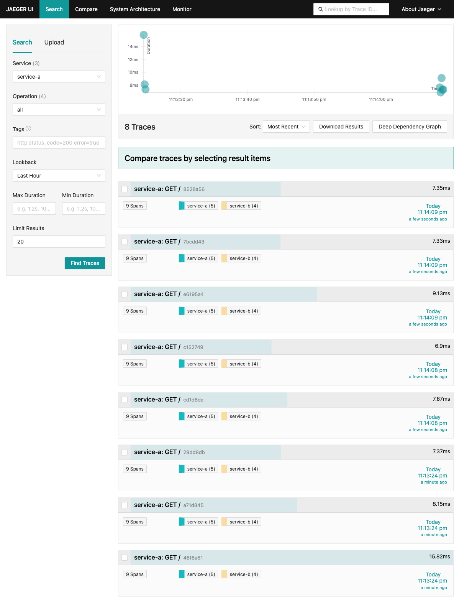
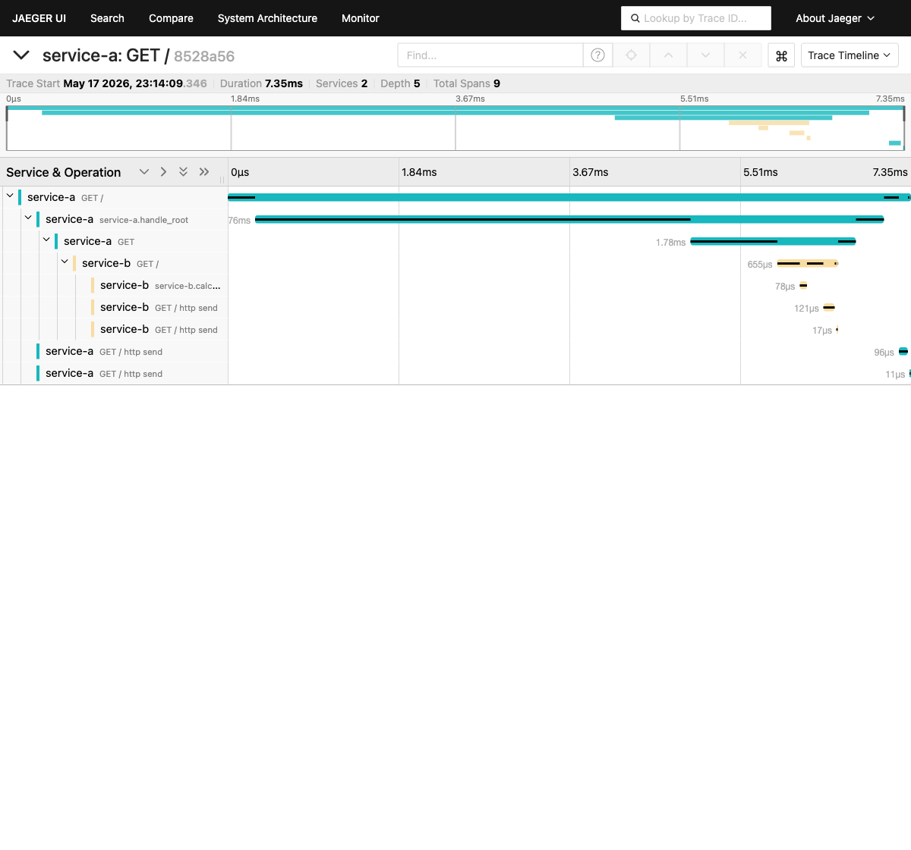

# Task 3 — Трейсинг


## Задание 3.1. Запуск MVP


Два сервиса на Python (FastAPI):
- **service-a** — корневой эндпойнт `GET /`, вызывает `service-b` через HTTP и агрегирует ответ.
- **service-b** — корневой эндпойнт `GET /`, имитирует расчёт цены по числу полигонов в 3D-модели.

Оба сервиса инструментированы OpenTelemetry SDK с экспортом OTLP/gRPC в Jaeger (`simplest-collector:4317`). Контекст пропагируется через стандартные HTTP-заголовки `traceparent` благодаря автоинструментации FastAPI и httpx.

### Требования

- Minikube
- kubectl
- Docker

### Шаги запуска

1. **Запустить Minikube:**

    ```bash
    minikube start --addons=ingress
    ```

2. **Установить cert-manager** (требуется Jaeger Operator):

    ```bash
    kubectl apply -f https://github.com/cert-manager/cert-manager/releases/download/v1.13.3/cert-manager.yaml
    kubectl -n cert-manager wait --for=condition=Available --timeout=180s deployment --all
    ```

3. **Развернуть Jaeger Operator и инстанс Jaeger:**

    ```bash
    kubectl create namespace observability
    kubectl create -f https://github.com/jaegertracing/jaeger-operator/releases/download/v1.51.0/jaeger-operator.yaml -n observability
    kubectl -n observability wait --for=condition=Available --timeout=180s deployment/jaeger-operator
    kubectl apply -f k8s/jaeger-instance.yaml
    kubectl wait --for=condition=Available --timeout=180s deployment/simplest
    ```

4. **Собрать образы сервисов и развернуть в Minikube:**

    ```bash
    minikube image build -t service-a:latest services/service-a/
    minikube image build -t service-b:latest services/service-b/
    kubectl apply -f k8s/services.yaml
    kubectl wait --for=condition=Available --timeout=120s deployment/service-a deployment/service-b
    ```

5. **Сделать вызов** (service-a вызывает service-b — обе операции попадают в один trace):

    ```bash
    kubectl exec -it $(kubectl get pods -l app=service-a -o jsonpath='{.items[0].metadata.name}') -- wget -qO- http://service-a:8080
    ```

6. **Открыть Jaeger UI:**

    ```bash
    kubectl port-forward svc/simplest-query 16686:16686
    ```

    Перейти в браузере: <http://localhost:16686>.
    В поле **Service** выбрать `service-a`, нажать **Find Traces** — будет виден трейс, охватывающий вызов `service-a → service-b`.

### Очистка

```bash
kubectl delete -f k8s/services.yaml
kubectl delete -f k8s/jaeger-instance.yaml
minikube stop
```

### Скриншоты

**Список трейсов в Jaeger UI** — 8 трейсов, каждый из 9 spans (5 у `service-a`, 4 у `service-b`):



**Детальный waterfall одного трейса** — виден сквозной trace_id, иерархия spans и кастомные spans `service-a.handle_root` → `service-b.calculate`:


