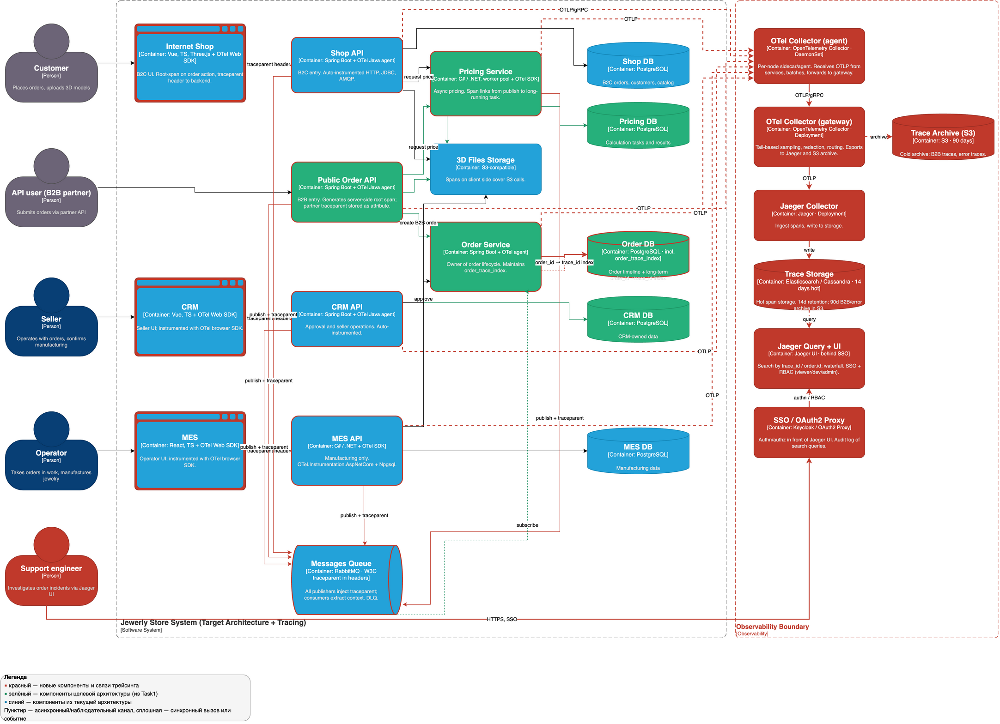
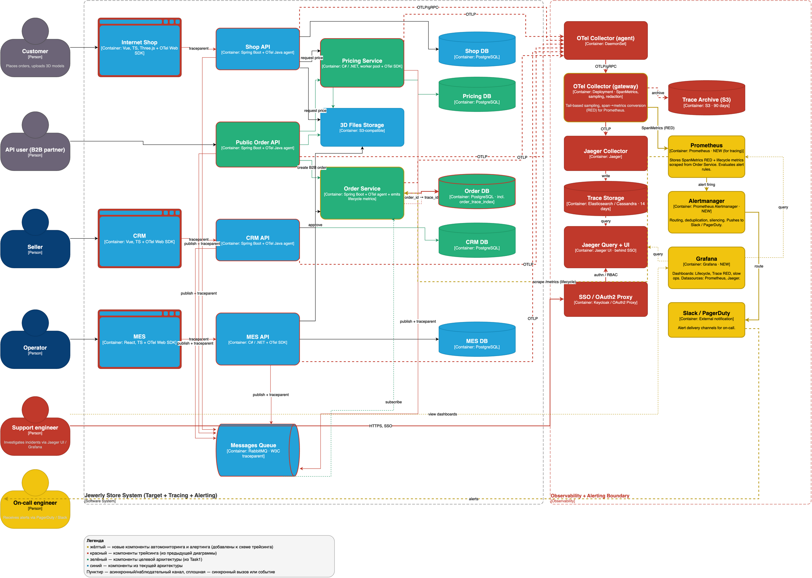

# Архитектурное решение по трейсингу

## 1. Места риска и покрытие

Трейсингом покрываются все компоненты целевой архитектуры, через которые проходит контекст заказа: Shop API, Public Order API, CRM API, MES API, Pricing Service, Order Service, фронтенды (Internet Shop / CRM / MES), RabbitMQ, PostgreSQL и S3. Не покрываются CI/CD, бэкап-задачи и аналитические выгрузки.

Точки, где заказ может «сломаться» или зависнуть:

| # | Точка риска | Чем опасно |
|---|---|---|
| R1 | Входы Shop API / Public Order API | Без серверного root-span невозможно сшить путь B2B-заказа. |
| R2 | Pricing Service (2–30 мин) | Самая длинная стадия — чаще всего «зависает» именно здесь. |
| R3 | Переходы через RabbitMQ | Потеря сообщений, DLQ, разрыв контекста — без `traceparent` в headers трейс рвётся. |
| R4 | Order Service — агрегация событий | От корректности сшивки зависят дашборд SLA и расчёт «времени в статусе». |
| R5 | CRM API → `MANUFACTURING_APPROVED` | Бизнес-задержка часы/дни; только трейс покажет, где время уходит — у людей или у системы. |
| R6 | PostgreSQL: долгие транзакции | Каскадные блокировки, исчерпание пулов. DB-spans дают наблюдаемость без серверной модификации. |
| R7 | Внешний webhook транспортной компании | Зависание на финальном статусе; партнёр не отправляет `traceparent` — нужен новый root-trace с линковкой по `order.id`. |

## 2. Данные в трейсинге

**Стандартные атрибуты OpenTelemetry** (автоматически): `trace_id`, `span_id`, `parent_span_id`, `service.name`, `service.version`, `deployment.environment`, HTTP/DB/messaging-атрибуты по semantic conventions, `exception.*` при ошибках, длительность span.

**Бизнес-атрибуты** (проставляются разработчиками): `order.id`, `order.status_from`, `order.status_to`, `order.channel` (`b2c`/`b2b`), `partner.id`, `customer.id` (хэш), `pricing.task_id`, `pricing.duration_seconds`, `pricing.polygon_count`, `manufacturing.operator_id`, `correlation_id` для сшивки с логами.

**Не попадает в трейсинг:** параметры SQL, тела HTTP/AMQP-сообщений, содержимое 3D-файлов, JWT/пароли/ключи — только хэши `partner_id`/`customer_id`.

## 3. Мотивация

Метрики и логи показывают **что** деградировало и **где** произошло. Главный вопрос бизнеса — **«где сейчас заказ №X и почему он там»** — без трейсинга остаётся без ответа: разбор жалобы партнёра требует ручного сопоставления логов трёх сервисов и сообщений RabbitMQ.

Эффект внедрения:

| Метрика | Тип | Ожидаемое изменение |
|---|---|---|
| MTTR инцидента по конкретному заказу | техническая | часы → минуты (запрос по `order.id` в Jaeger) |
| MTTD проблемы на стыке сервисов | техническая | сокращение за счёт алертов на длительность span'ов |
| Точность алертов (signal-to-noise) | техническая | рост (таргетированные алерты вида «MES API медленно при работе с MES DB») |
| Доля заказов с нарушением SLA «3 недели» | бизнес | снижение за счёт проактивного выявления застрявших заказов |
| Время реакции на жалобу B2B-партнёра | бизнес | секунды на поиск трейса вместо часов разбора логов |
| Стоимость операционной поддержки | бизнес | снижение эскалаций в инженерную команду |

## 4. Предлагаемое решение

**Стек:** **OpenTelemetry SDK** в каждом сервисе → **OTel Collector** (DaemonSet-agent + Deployment-gateway) → **Jaeger** (Collector + UI, хранилище Elasticsearch/Cassandra). Транспорт — **OTLP/gRPC**. Пропагация контекста — **W3C Trace Context** (`traceparent`) и через AMQP-заголовки RabbitMQ. Корреляция с логами — `trace_id` в structured logs; с метриками — exemplars в Prometheus.

**Изменения в существующих компонентах:**
- Spring Boot-сервисы (Shop API, CRM API, Public Order API, Order Service) — `opentelemetry-javaagent.jar` (auto-instrumentation).
- .NET-сервисы (MES API, Pricing Service) — `OpenTelemetry.Instrumentation.AspNetCore` + OTLP-exporter.
- Frontend (Internet Shop, CRM, MES) — `@opentelemetry/sdk-trace-web`, root-span на пользовательском действии.
- RabbitMQ-клиенты — обязательная inject/extract `traceparent`; для длинных задач Pricing — `link` вместо parent-child.
- Public Order API — генерация серверного root-span; внешний `traceparent` сохраняется как атрибут, не как parent.

**Семплинг** двухуровневый: head-based на SDK (100% бизнес-операций, 0% healthcheck'ов), tail-based в Collector — 100% ошибок, 100% B2B, 100% медленнее p99, 10% baseline для остального.

**Хранение:** 14 дней горячих трейсов (ES/Cassandra), 90 дней архив B2B и ошибочных трейсов (S3 через Tempo/Jaeger archive). Индексная таблица `order_trace_index` в Order DB хранит `order.id ↔ trace_id` 1 год — для долгосрочного аудита.

Доработанная C4-диаграмма (новые компоненты — **красные**):

Исходник: [jewerly_c4_tracing.drawio](jewerly_c4_tracing.drawio).

### 4.1. Автоматический мониторинг и алертинг (доп. задание)

Continuous monitoring строится на двух источниках:
- **SpanMetrics processor** в OTel Collector конвертирует spans в RED-метрики Prometheus.
- **Order Service** (владелец сквозного статуса) дополнительно публикует через Micrometer на `/metrics`: `order_in_status_duration_seconds{status, channel}`, `orders_in_status_total`, счётчики нарушений SLA. Prometheus скрейпит эндпойнт.

Отдельный «Lifecycle Monitor» не вводится — Order Service уже подписан на нужные события. Алерты — это PromQL-правила в Prometheus, маршрутизация — через **Alertmanager** в Slack/PagerDuty, дашборды — в **Grafana**.

Ключевые алерты:

| Алерт | Условие | Severity |
|---|---|---|
| `OrderStuckInStatus` | `order_in_status_duration_seconds{status="PRICE_CALCULATED"} > 4h` | warning; > 24h — critical |
| `B2BOrderSLABreach` | `order_in_status_duration_seconds{channel="b2b"} > 18d` | critical |
| `TraceErrorRate` | доля `status_code="ERROR"` в SpanMetrics > 2% за 5 мин | critical |
| `MessageProcessingDelay` | p99 `messaging.process` для `pricing.tasks` > 30 мин | critical |
| `OrphanedOrders` | расхождение `orders_created_total` (Shop API) vs `orders_seen_total` (Order Service) > 0 за 5 мин | warning |

Диаграмма с компонентами автомониторинга (новые элементы — **жёлтые**):

Исходник: [jewerly_c4_tracing_alerting.drawio](jewerly_c4_tracing_alerting.drawio).

## 5. Компромиссы

| Случай | Причина |
|---|---|
| Долгосрочный тренд-анализ (месяцы) | Трейсы — высокообъёмные, краткосрочные. Эффективнее агрегированные метрики Prometheus. |
| Отказы сетевой инфраструктуры (DNS, балансировщик) | Сервис не успевает создать span; данные нужны из логов инфраструктуры. |
| Внешний webhook без `traceparent` | Принимаем как новый root, линкуем через `order.id` в индексной таблице. |
| C#-код MES без исходников проприетарных модулей | Auto-instrumentation покрывает только периметр (HTTP/AMQP). Полная инструментация — отложить до согласования с поставщиком. |
| Высокая стоимость 100%-семплинга в проде | Снижаем tail-based семплингом; пересмотр порогов через 1 месяц по фактическим объёмам. |
| Overhead 1–5% latency на сервисах | Mitigated через sidecar-Collector + батчинг + gzip; учесть в performance budget. |

## 6. Безопасность

- **Аутентификация Jaeger UI** — корпоративный SSO (Keycloak / OAuth2 Proxy). Анонимный доступ запрещён.
- **Ролевая модель:** `tracing.viewer` (поддержка, продакт), `tracing.developer` (инженеры, raw payload), `tracing.admin` (DevOps, конфигурация).
- **Аудит** всех поисковых запросов в Jaeger UI (кто, когда, по какому `order.id`/`partner.id`) — хранится отдельно от спанов.
- **Сетевая изоляция:** Jaeger UI и Collector — без публичного доступа, только VPN/корпоративная сеть. Доступ через `NetworkPolicy` в Kubernetes по allow-list.
- **Внешний `traceparent` не доверяется** — Public Order API всегда генерирует свой серверный root; внешний — атрибут для аудита.
- **PII в спанах запрещён** соглашением; **redaction processor** в OTel Collector вычищает email/phone/card по списку. `db.statement` — без значений параметров.
- **Шифрование:** TLS на всех каналах (OTLP, ingest, UI); at-rest для хранилища трейсов.
- **Rate-limit** на OTLP-приёме в Collector — защита от затопления мусорными спанами.
