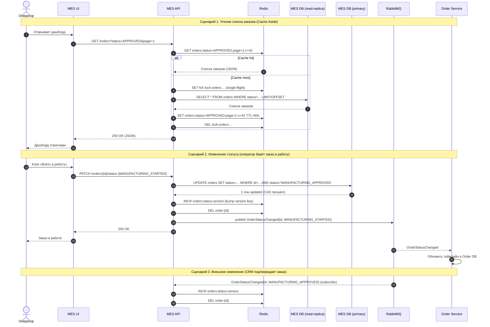

# Архитектурное решение по кешированию

## 1. Мотивация

### 1.1. Контекст

Операторы MES жалуются на медленную загрузку дашборда — это первая страница, с которой начинается рабочая смена. На странице отображается список заказов в работе с фильтром по статусам и пагинацией. Несмотря на уже сделанную пагинацию и фильтр, страница продолжает тормозить.

В Task1 узкое место было идентифицировано как сочетание двух факторов:
- **B2** — неэффективные выборки и отсутствие индексов под сортировку «новые сверху»;
- **A2** — конкуренция дашборда с длительным расчётом цены за CPU MES API.

Инициативы **I2** (вынос расчёта в Pricing Service) и **I7** (read-реплика MES DB) сняли значительную часть нагрузки. Тем не менее остаётся структурная проблема: дашборд — это **горячий read-heavy эндпойнт**, который читается всеми операторами одновременно и часто (страница обновляется регулярно, операторы конкурируют за свежие заказы по модели «кто первый кликнул»). Даже после переноса чтения на реплику и добавления индексов, каждый просмотр дашборда транслируется в SQL-запрос к БД.

### 1.2. Почему кеширование

Запросы списка заказов имеют три свойства, делающих кеш высокоэффективным инструментом:

1. **Высокая повторяемость.** Все операторы видят примерно одну и ту же выборку («новые заказы в статусе MANUFACTURING_APPROVED, страница 1»). Запросы с разных пользователей разрешаются в идентичный ключ.
2. **Низкая частота изменений относительно частоты чтений.** Статусы заказов меняются десятки раз в час, тогда как страница перечитывается тысячи раз в час. Соотношение read/write делает кеш экономически целесообразным.
3. **Толерантность к небольшой задержке консистентности при правильной инвалидации.** Операторы должны видеть свежие заказы, но «свежие» — это секунды, а не миллисекунды. Это допускает короткое окно устаревания при условии явной инвалидации на запись.

### 1.3. Какие проблемы решает кеширование

| Проблема | Эффект от кеша |
|---|---|
| Дашборд MES долго грузится при росте числа операторов | Cache hit отдаёт ответ за единицы миллисекунд, без обращения к БД |
| Конкуренция операторов за свежие заказы создаёт всплески одинаковых запросов | Cache stampede предотвращается через `SETNX`-лок на промахе; первый запрос идёт в БД, остальные читают результат |
| Read-реплика MES DB загружена дашбордом и параллельным трафиком MES API | Снижение нагрузки на реплику на порядок, реплика остаётся доступной для редких/тяжёлых аналитических запросов |
| Линейный рост числа операторов будет линейно увеличивать число SQL-запросов | Число запросов в БД растёт по числу инвалидаций, а не по числу чтений |

### 1.4. Что предлагается включить в кеш

В скоупе этого решения — **серверный кеш списка заказов и сводных счётчиков дашборда MES**:

- `GET /orders` с фильтром по статусу, пагинацией, сортировкой;
- `GET /orders/counts` — счётчики заказов по статусам (бейджи в навигации).

Вне скоупа (обосновано отдельно):
- **Карточка отдельного заказа** — редкие чтения, низкая выгода от кеша.
- **3D-файлы** — отдаются по прямому presigned URL из S3, кеш не нужен.
- **Результаты расчёта цены** — отдельная задача для Pricing Service; кешируется по хешу 3D-модели и набору параметров. В этом документе не рассматривается.
- **Каталог Shop** — отдельный read-heavy кейс на стороне Shop API, рассматривается отдельным решением.

---

## 2. Предлагаемое решение

### 2.1. Серверный или клиентский кеш

Сравнение применительно к дашборду MES:

| Критерий | Клиентский кеш (браузер: HTTP cache, IndexedDB) | Серверный кеш (Redis перед MES API) |
|---|---|---|
| Разделяемость между пользователями | Нет — у каждого оператора свой кеш | Да — один экземпляр данных используется всеми операторами |
| Эффективность hit rate | Низкая: первый запрос каждого оператора идёт мимо кеша | Высокая: hit с первого запроса при «прогретом» ключе |
| Согласованность между операторами | Низкая: операторы видят разные снимки данных | Высокая: все читают один и тот же ключ |
| Совместимость с моделью «кто первый кликнул» | Опасна: устаревший локальный список приводит к гонке за уже взятый заказ | Управляема: инвалидация на запись синхронизирует всех |
| Возможность контроля памяти | Нет — зависит от клиента | Да — LRU, TTL, лимиты на стороне Redis |
| Возможность инвалидации по событию | Только через push (SSE/WebSocket) — отдельная подсистема | Простая: `DEL` по ключу или паттерну |

**Выбор: серверный кеш.** Решающий аргумент — модель «кто первый кликнул, тот взял заказ». Клиентский кеш создаёт ситуацию, при которой два оператора видят свой локальный список и оба пытаются взять один и тот же заказ; сервер вынужден разрешать конфликт, у одного из операторов запрос завершается ошибкой. Серверный кеш обеспечивает единую точку правды и согласованную инвалидацию.

Клиентский кеш не отвергается полностью: HTTP-заголовки `ETag` и `Cache-Control: private, max-age=2` используются как **второй слой** — они снижают трафик при частом обновлении страницы конкретным оператором, но не подменяют общий снимок. Этот слой — оптимизация второго порядка и в дальнейшем рассмотрении не участвует.

### 2.2. Размещение и технология

- **Где:** Redis (Yandex Managed Redis) рядом с MES API, отдельный инстанс, не разделяется с другими сервисами.
- **Между чем и чем:** MES API ↔ Redis ↔ MES DB read-replica. Кеш не виден клиенту и не виден другим сервисам.
- **HA:** Redis в режиме master + replica + sentinel либо Redis Cluster (по факту нагрузки). На старте — master + replica.
- **Память:** старт с 1 ГБ; пересмотр после месяца наблюдений за hit rate и распределением размеров ключей. Политика вытеснения — `allkeys-lru`.
- **Сериализация:** JSON для совместимости с C# (MES API) и Spring Boot (на случай переиспользования). Бинарные форматы (MessagePack) рассматриваются после замеров.

### 2.3. Паттерн кеширования: Cache-Aside

#### 2.3.1. Выбор

Применяется паттерн **Cache-Aside** (Lazy Loading):
- На чтении приложение сначала идёт в кеш; при промахе — в БД, кладёт результат в кеш и возвращает клиенту.
- На записи приложение пишет в БД и **инвалидирует** связанные ключи в кеше (write-around + invalidate).

#### 2.3.2. Почему не Write-Through

| Аспект | Cache-Aside | Write-Through |
|---|---|---|
| Поведение при записи | Запись в БД + инвалидация ключей | Запись в БД + синхронная запись в кеш (либо запись в кеш и сквозь него в БД) |
| Latency записи (смена статуса заказа) | Минимальная: один UPDATE + быстрый `DEL` | Выше: UPDATE + перестроение всех затронутых ключей кеша |
| Сложность инвалидации сводных запросов (списки, счётчики) | Низкая: `DEL` по ключу | **Высокая:** при смене одного статуса нужно пересчитать все страницы со всеми фильтрами, в которых заказ мог появиться или исчезнуть — это, по сути, тот же запрос к БД |
| Реакция на изменения, инициированные другой системой (CRM подтверждает заказ) | Согласована: обработчик события из MQ делает `DEL` | Несогласована: либо CRM должен писать в кеш MES (нарушение границ), либо MES всё равно нуждается в Cache-Aside для внешних событий |
| Поведение при отказе кеша | Деградация в режим «всегда мимо кеша», приложение продолжает работать | Запись зависит от доступности кеша; рост latency и риск таймаутов |

Принципиальный аргумент против Write-Through в нашем случае: данные дашборда — это **производные представления** (выборка списка с сортировкой и пагинацией, счётчики), а не сами объекты заказов. Write-Through кеширует доменную сущность; здесь же кешируются результаты запросов. Поддерживать актуальность всех страниц всех фильтров на каждой записи дороже, чем просто их инвалидировать.

#### 2.3.3. Почему не Refresh-Ahead

| Аспект | Cache-Aside | Refresh-Ahead |
|---|---|---|
| Кому подходит | Произвольные ключи, в т. ч. редкие комбинации фильтров | Заранее известное небольшое множество «горячих» ключей |
| Поведение перед истечением TTL | Ничего; при следующем чтении — повторное обращение к БД | Фоновое обновление до истечения TTL |
| Поведение при изменении данных | Точная инвалидация по событию | Не реагирует — обновление по таймеру; данные могут отставать вплоть до полного периода refresh |
| Применимость к нашему случаю | Прямая | Неудачная: множество ключей (фильтр × сортировка × страница × роль), горячих среди них немного и они быстро меняются по составу |
| Стоимость поддержки | Низкая | Высокая: фоновый воркер, очередь refresh-задач, защита от штормов обновлений |

Refresh-Ahead имеет смысл там, где БД не справляется даже с инвалидационным трафиком и где есть стабильный набор горячих ключей (например, главная страница каталога). У нас число «активно открытых» комбинаций фильтров намного больше числа подкачек, а данные меняются непредсказуемо событиями смены статуса. Refresh-Ahead в такой среде сводится к периодическим бесполезным обновлениям ключей, которые уже инвалидированы.

#### 2.3.4. Сводная таблица

| Паттерн | Подходит | Не подходит | Решение |
|---|---|---|---|
| **Cache-Aside** | Минимальная latency на запись, простая инвалидация, устойчивость к падению кеша, естественная обработка изменений от внешних систем через события | На промахе первый клиент платит полную стоимость запроса (смягчается single-flight через `SETNX`) | **Выбран** |
| Write-Through | Кеш всегда в согласованном состоянии с БД для сохраняемой сущности | Не применим к производным представлениям (списки, счётчики); удорожает критичный путь записи; не решает кейс с внешними изменениями | Отклонён |
| Refresh-Ahead | Стабильно горячие ключи с предсказуемым TTL; защита от штормов на инвалидации | Большое и подвижное множество ключей; данные меняются событийно, а не по таймеру | Отклонён |

### 2.4. Диаграмма последовательности

Ниже — операции чтения списка заказов и изменения статуса заказа с участием кеша.

Пояснения к диаграмме:

- **Шаги 3–9 (чтение):** Cache-Aside в чистом виде. Single-flight через `SETNX` защищает от cache stampede: при одновременном промахе нескольких операторов только один идёт в БД, остальные ждут результата или короткого backoff.
- **Шаг 10 (ключ с версией):** ключи списков содержат версию (`v=42`), которая хранится в отдельном счётчике. Инкремент счётчика (шаг 17) автоматически делает все старые ключи невалидными без явного `DEL` по паттерну (подробнее в § 2.5.3).
- **Шаги 16–19 (запись):** UPDATE с CAS (`AND status='MANUFACTURING_APPROVED'`) защищает от гонки операторов на бизнес-уровне — только один оператор успешно возьмёт заказ. Bump версии инвалидирует все списковые ключи; `DEL order:{id}` — карточку заказа, если она тоже в кеше. Событие в MQ публикуется через outbox-паттерн внутри той же транзакции (на диаграмме опущено для читаемости).
- **Шаги 24–27 (внешнее изменение):** MES API подписан на события статусов из других сервисов (CRM, Shop). Те же действия по инвалидации, но триггер — не локальная запись, а событие.

### 2.5. Стратегия инвалидации

#### 2.5.1. Выбор

Применяется **программная событийная инвалидация по ключу со страховочным TTL**:

1. **Основной механизм** — программная инвалидация: при изменении статуса заказа (локально или по событию из MQ) MES API явно инвалидирует затронутые ключи.
2. **Гранулярность списков** — через **версионирование ключей**: ключи содержат версию (`orders:status=X:page=N:v=42`); инвалидация — это атомарный `INCR` версионного счётчика, что делает все старые ключи невалидными за одну операцию.
3. **Страховочный TTL** — 60 секунд для списков, 5 минут для счётчиков. Защита от пропущенных событий (рассинхронизация MQ, баги в обработчиках инвалидации, рестарт сервиса между UPDATE и публикацией события).

#### 2.5.2. Источники инвалидации

| Источник | Что инвалидируется | Механизм |
|---|---|---|
| MES API: смена статуса оператором (started/completed/packaging/shipped) | Версия списков, `order:{id}` | Прямая инвалидация в коде обработчика |
| CRM API: MANUFACTURING_APPROVED | Версия списков MES (появляется новый заказ) | Подписка MES API на событие из MQ |
| CRM API: CLOSED | Версия списков MES, `order:{id}` | Подписка MES API на событие |
| Истечение TTL | Любой ключ | Redis (страховка) |

#### 2.5.3. Версионирование ключей

Списки заказов параметризованы (статус × страница × размер страницы × сортировка). Прямая инвалидация по паттерну (`KEYS orders:*` или `SCAN`) дорога и опасна в production. Решение — **версионный счётчик**:

- Хранится ключ `orders:version` (значение — целое).
- Все списковые ключи включают текущее значение версии: `orders:status=APPROVED:page=1:v=42`.
- Инвалидация — `INCR orders:version`. Старые ключи остаются в Redis до истечения TTL, но не читаются (новые запросы используют другую версию в ключе).
- Затраты на «мусор» в Redis ограничены TTL и политикой `allkeys-lru`.

Версии могут быть детализированы по статусам (`orders:version:APPROVED`), если профиль изменений показывает, что одни статусы меняются часто, а другие — редко. На старте — одна общая версия, оптимизация по данным.

#### 2.5.4. Сравнение стратегий инвалидации

| Стратегия | Где подходит | Почему не подходит у нас | Решение |
|---|---|---|---|
| **Программная по событию + TTL-страховка** | Системы с понятными триггерами записи и наличием шины событий; требование высокой актуальности | — | **Выбрана** |
| **Только TTL (временная)** | Данные, у которых нет явного триггера изменения, или допустимо устаревание на весь TTL | Несовместимо с моделью «кто первый кликнул»: устаревший список в течение TTL приводит к гонкам и ошибкам у операторов. Снижение TTL до 1–2 секунд превращает кеш в бесполезный | Отклонена |
| **Только по ключу без TTL** | Системы, в которых гарантирована доставка всех событий инвалидации (синхронная инвалидация в одной транзакции) | У нас инвалидация по событиям из MQ; гарантия at-least-once, но не in-order, и возможны сбои обработчика. Без TTL рассинхронизация может жить часами и обнаружиться только по жалобе | Отклонена |
| **Write-Through (синхронная перезапись кеша)** | Кеш доменных объектов с дешёвым перевычислением | Списки и счётчики дёшево не пересчитываются; перезапись = повторный запрос к БД (см. § 2.3.2) | Отклонена |
| **Refresh-Ahead (упреждающее обновление)** | Стабильно горячие ключи с предсказуемым TTL | Подвижное множество ключей; изменения событийные, а не периодические (см. § 2.3.3) | Отклонена |

#### 2.5.5. Обработка отказов

| Сценарий | Поведение |
|---|---|
| Redis недоступен | MES API ходит напрямую в read-реплику MES DB. Cache layer возвращает ошибку, обёртка переключается на fallback. Алерт on-call. |
| Потеря события инвалидации в MQ | Страховочный TTL ограничивает окно устаревания. После TTL ключ перечитывается из БД. |
| Stale данные у оператора | UPDATE статуса использует CAS на ожидаемом статусе; устаревший клик завершается ошибкой «заказ уже взят», UI перечитывает список. |
| Падение MES API между UPDATE и публикацией события | Outbox-паттерн: событие записывается в БД в той же транзакции и публикуется отдельным релейером с гарантией at-least-once. |

#### 2.5.6. TTL — обоснование значений

- **Списки заказов: 60 секунд.** Верхняя граница допустимого устаревания, при которой страховочный путь (TTL) активируется быстрее, чем оператор успеет заметить отсутствие нового заказа. Меньше — теряем выгоду кеша на коротких всплесках; больше — рискуем заметным окном устаревания при сбое событийной инвалидации.
- **Счётчики по статусам: 5 минут.** Счётчики менее критичны к актуальности (это бейджи навигации, а не основания для бизнес-решений). Большой TTL компенсирует частоту чтений.
- **Карточка заказа: 5 минут.** Карточка инвалидируется явно по событию; TTL — страховка.
- Значения пересматриваются после 1–2 месяцев наблюдения за hit rate и долей stale-чтений (см. § 4).

---

## 3. Альтернативное решение (дополнительное задание)

Рассматривается альтернатива — **серверный кеш + push-инвалидация на клиенте через SSE/WebSocket** — как вариант с более жёсткой согласованностью между операторами и более высокой инженерной стоимостью.

### 3.1. Сопоставление решений

| | **Решение 1. Cache-Aside + событийная инвалидация (предлагаемое)** | **Решение 2. Cache-Aside + push-обновления клиенту через SSE/WebSocket** |
|---|---|---|
| **Описание** | Серверный Redis перед MES API. Cache-Aside для чтения. Программная инвалидация по событиям из MQ + версионирование ключей + страховочный TTL. Клиент периодически перечитывает список (polling, например 5 с) или вручную. | Тот же серверный Redis и тот же Cache-Aside на сервере. Дополнительно MES API публикует обновления в SSE/WebSocket-канал; клиент держит постоянное соединение и получает события смены статусов. Локальный список на клиенте обновляется без перезагрузки страницы. |
| **Диаграмма** | См. § 2.4 | Те же шаги § 2.4 + дополнительный канал: после шага 19 (UPDATE + INCR версии) MES API публикует SSE-событие всем подключённым операторам; клиенты обновляют локальный список, не делая полный GET |
| **Плюсы** | • Минимальная инженерная сложность • Не требует stateful-соединений на API • Совместимо с горизонтальным масштабированием MES API «из коробки» • Граница ответственности кеша чёткая: только Redis • Достаточно для решения текущих жалоб операторов | • Мгновенное появление новых заказов у операторов (сотни мс вместо секунд) • Снижение polling-трафика • Лучшая модель «кто первый кликнул»: уменьшается окно гонки между операторами |
| **Минусы** | • Окно устаревания на клиенте равно интервалу polling (5–10 с) • При активной гонке операторов возможен «фантомный клик» по заказу, который уже взят (компенсируется CAS на UPDATE) | • Stateful API-сервис: соединения нужно роутить (sticky sessions либо общая шина внутри MES API) • Дополнительный слой: SSE/WS-gateway, обработка переподключений, backpressure • Усложнение тестирования и QA-сценариев • Дополнительная нагрузка на инфраструктуру (open connections, keep-alive) • Требует фронтенд-работы в MES (React) на стейт-машину канала |

### 3.2. Заключение

На текущем этапе выбирается **Решение 1**. Аргументы:

1. **Соответствие масштабу проблемы.** Жалобы операторов касаются *медленной загрузки страницы*, а не *задержки появления новых заказов*. Решение 1 закрывает заявленную проблему: hit-rate на горячих списках выводит время ответа дашборда из секунд в миллисекунды.
2. **Стоимость / срок.** Решение 1 реализуется силами текущей команды без новых компонентов. Решение 2 требует SSE/WebSocket-инфраструктуры и значительной фронтенд-работы — это отдельный эпик, конкурирующий за приоритет с I4 (pull-очередь назначения операторов).
3. **Совместимость с I4.** Инициатива I4 из плана Task1 заменяет модель «кто первый кликнул» на pull-очередь со справедливым распределением. После I4 ценность мгновенного push-уведомления о новом заказе падает: оператор не «выхватывает» заказ кликом, а получает следующий из очереди. Инвестировать в SSE до реализации I4 — преждевременно.
4. **Эволюционный путь.** Решение 2 — естественное расширение Решения 1: при необходимости push-канал добавляется поверх существующего серверного кеша без переделок. Если после I4 и Решения 1 жалобы на «опоздание к новому заказу» сохранятся, Решение 2 рассматривается как следующая итерация.

---

## 4. Метрики успеха

Внедрение оценивается по следующим показателям (собираются в Prometheus, см. Task2):

| Метрика | Целевое значение | Назначение |
|---|---|---|
| `cache_hit_ratio` для `GET /orders` | > 80% после прогрева | Базовая эффективность кеша |
| p95 latency `GET /orders` | < 100 мс (было: единицы секунд) | Прямая метрика боли операторов |
| RPS к read-реплике MES DB на эндпойнтах списков | Снижение в ≥ 5 раз | Подтверждение разгрузки БД |
| Доля stale-чтений (по логам CAS-конфликтов на UPDATE) | < 0.5% | Контроль качества инвалидации |
| Cache eviction rate (`maxmemory` exhausted) | 0 в норме | Контроль ёмкости |

Пересмотр TTL, размера Redis и стратегии версионирования — через 1 месяц после выхода в prod на основании этих данных.
